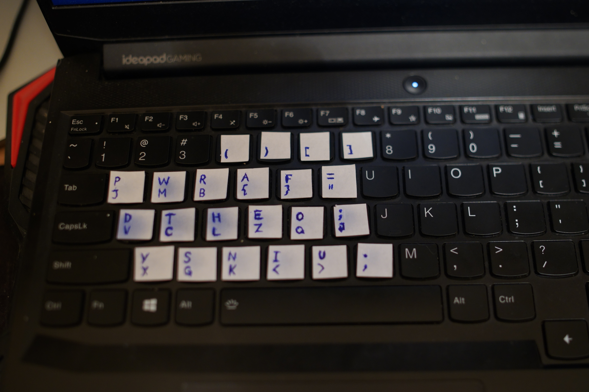

# FrogPad

FrogPad keyboard layout designed for programmers.

Recently, I broke my right arm, so I had to code few weeks with only my left arm.
Now, I have a great appreciation for accessibility, hence I wrote this AHK script.
The script recreates the FrogPad layout on the left side of the keyboard.

I'm aware of the [DupePad](github.com/clarkm/dupepad) script which does the same thing,
but it's more suited for typing and less for coding. This script focuses on putting the
most used coding symbols on easy-to-access keys. Another major addition are the arrow keys.
They are positioned on the WASD keys (with ALT being the modifier that enables them).
This makes the layout very familiar to gamers alike.

### Contributions

Everyone is welcomed and encouraged to contribute to this script.
I would like someone to recreate the FrogPad layout for the right arm as well
with the same coding spirit in mind.
